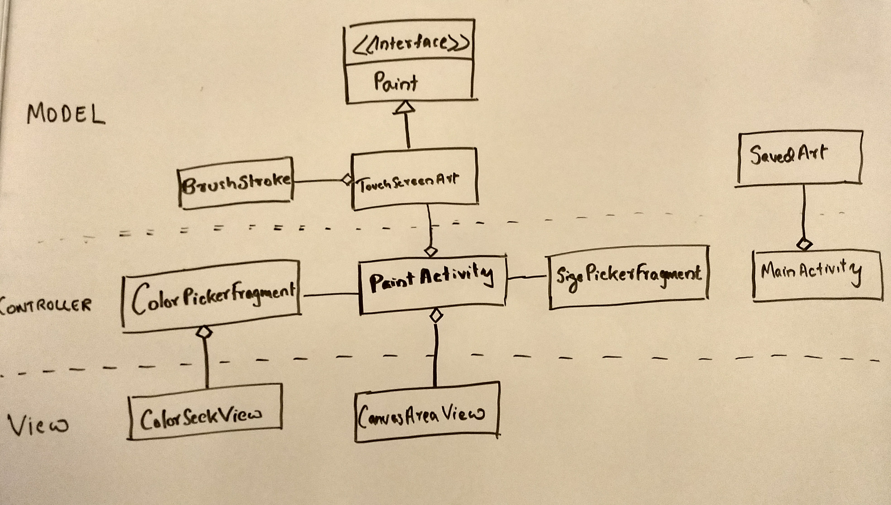

# Paint Android App

A basic drawing program.  
• The application allows user to select a color and to draw with their finger on the screen.  
• The application also allows to clear the drawing.  

You can access apk [https://github.com/varunrpillai/paint/blob/master/just_paint.apk]

## Competitor App Analysis - Apps from Google Play Store  
1) <t>Sketch App </t>- https://play.google.com/store/apps/details?id=com.sonymobile.sketch&hl=en  
  In the upper tab:  
    Brush size is selected by a slider. 
    Basic colors provided for selection in addition to a color picker option.  
    Eraser  
  In the lower tab:  
	  Undo, Redo stroke options.
	  On confirmation, user will be able to save, share and discard the artwork options.  
	  
2) Paint App - https://play.google.com/store/apps/details?id=nanashi.studios.paint&hl=en  
   In the upper tab:   
    save, clear, undo options.  
   In the overflow menu:  
    Load, Share, Exit options.
   In the lower tab:   
    color picker option.
   In the right tab:   
    brush size picker option.
  
3) ibisPaintX App  - https://play.google.com/store/apps/details?id=jp.ne.ibis.ibispaintx.app&hl=en  
  In the home page: show saved images and provides + icon to create Image.  
  In the lower tab:   
    In the paint view, opacity and brush size are slider.proble
    color selection is above these two.  
  Upper tab:   
    undo, redo options. 
    
    
  ###  Minimum Viable Product(MVP) based on the analysis:
    1) In the paint view, provide options to 
      In the upper tab:
       a) save
       b) exit without saving.
       c) continue drawing.
       d) clear the current painting.
       e) undo the last change
      In the Lower tab: This has the most important action items:
	a) color picker will be 
	   i) a floating button that shows the selected color.
	   ii) A color picker dialog will be launched on clicking the button.
	b) size picker will be on the left side
	   i) A size picker dialog will be launched on clicking the button.
	**Floating button will be hidden when user draws providing maximum canvas space.
     2) Have a list of saved items to continue editing the art.

## Main Usercases
1) Draw an art and save
   a) Open app
   b) Press on add button
   c) draw with defaults brush color and size.
   d) click on checkmark to save.
   e) enter the name and click save.
   Verify: If the name appears in the main list view.
   f) click on the list item in main list view.
   Verify: The previous painting reappears and able to edit it.
    
 2) Pick color
   a) Open app
   b) Press on add button
   c) draw with defaults brush color and size.
   d) click on color picker on the right side.
   e) drag and select the color.
   f) click checkmark to select.
   Verify: See if the floating button color changes and further painting reflects the same color.
  
 3) Pick size 
   a) Open app
   b) Press on add button
   c) draw with defaults brush color and size.
   d) click on size picker on the left side.
   e) drag and select the size.
   f) click checkmark to select.
   Verify: See if the further painting reflects the picked size.
   
 4) Clear drawing
   a) Open app
   b) Press on add button
   c) draw with defaults brush color and size.
   d) click on clear (cross icon) on the upper toolbar.
   e) dialog appears to clear the drawing.
   f) click on clear.
   Verify: See if the painting clears.
   
## Paper Prototyping
 

## Initial Design
 

## Known Issues
1) Writing the app data into filesystem is in an asynchronous operation but reading is not yet.
2) Color picker gradient values are adjusted (not working with calculated values).
3) Rotation is supported in the main activity. Rotation is restricted to portrait mode in paint view. 
   The canvas needs to be resized to support landscape. Some of the popular paint app supports only
   portrait mode.
3) If painting is saved with the existing name, warning is not displayed currently.
4) Added only one junit test case(to setup the infrastructure). Add more unit tests to ensure all cases are handled.
5) Can work on additional features for achieving feature parity with competitor apps.
6) Tested on OPPO A57. Need to test on more devices to address any fragmentation issues.

